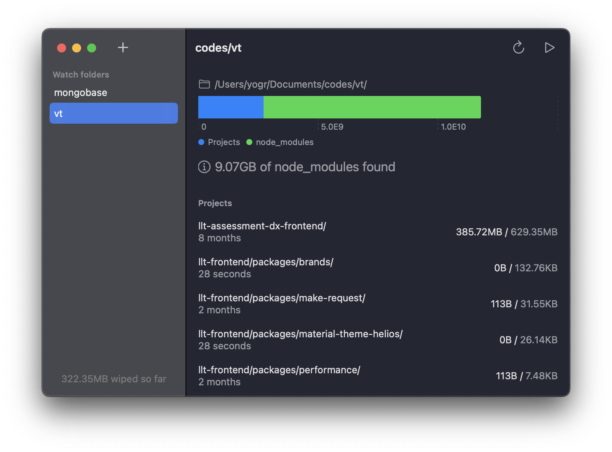

# Wipe_Modules

Clean all `node_modules` from projects that have turned stale. It works by scanning folders you add to the Watch list. You can select the folder where you keep all your projects (from tutorials, experiments or old gigs) and it'll recursively scan for node_modules folders.

Files are not deleted instantly but moved to the Trash (just to be sure before emptying the Trash).

🌵 Will keep improving and adding new features

Check [releases](https://github.com/blackmann/Wipe_Modules/releases) page to download latest version.

⚠️ To launch app for the first time, right click and select open.
